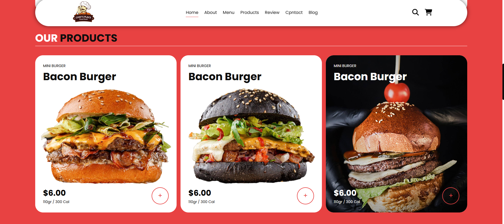
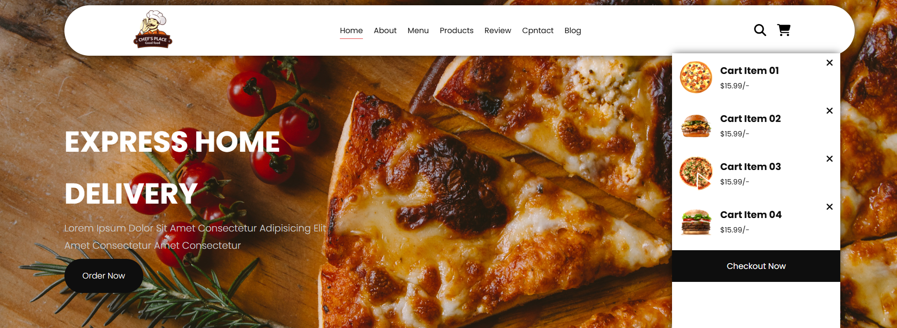
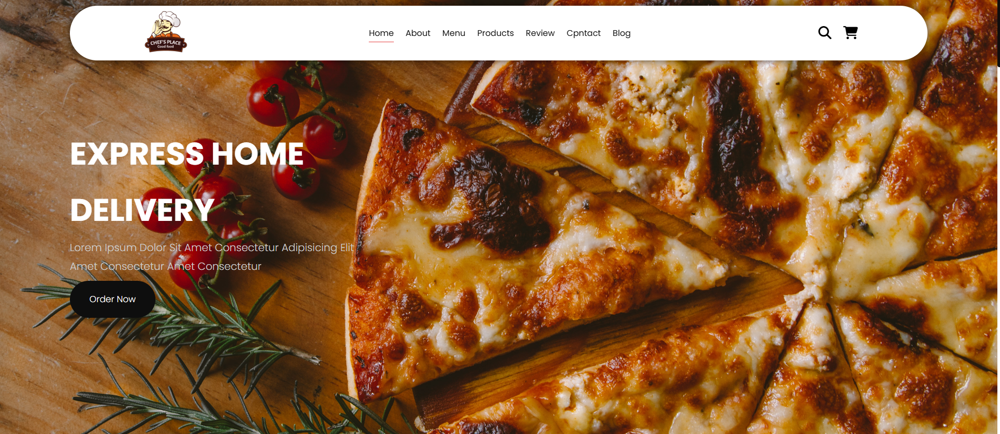

# my-foodwebsite
Food Website
# <h2>Proje neyi amaçlıyor?</h2>

Bu proje, bir restoranın web sitesini oluşturmak amacıyla geliştirilmiştir. Web sitesi, kullanıcıların menüyü görüntüleyebileceği, sipariş verebileceği, ürünleri inceleyebileceği ve restoran hakkında bilgi alabileceği çeşitli bölümlerden oluşmaktadır.

<h2>Özellikler</h2>

Responsive Tasarım: Mobil, tablet ve masaüstü cihazlarla uyumludur.
Modern UI/UX: Kullanıcı dostu ve şık bir arayüz.
Dinamik İçerik: JavaScript ile etkileşimli bileşenler.
CSS Animasyonları: Kullanıcı deneyimini artıran görsel efektler.

<h2>Kullanılan Teknolojiler</h2>

HTML5
CSS3 (Flexbox & Grid, Animasyonlar)
JavaScript (ES6+)

<h2>Kurulum</h2>


Bu projeyi kendi bilgisayarınızda çalıştırmak için aşağıdaki adımları takip edebilirsiniz:

### Gereksinimler

- Bir web tarayıcısı (Chrome, Firefox vb.)

### Kurulum

1. Bu repo'yu bilgisayarınıza klonlayın:
   ```bash
   git clone https://github.com/korkmazahmet/my-foodwebsite.git





  


index.html dosyasını tarayıcınızda açın.
